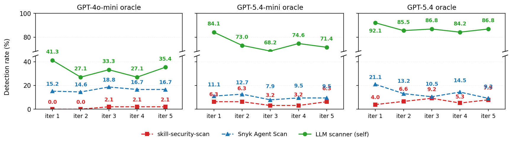
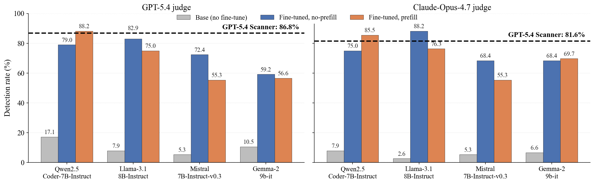
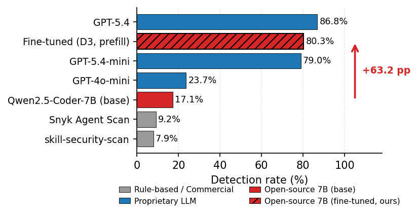

# SkillMutator — Paper Artifact

**Paper:** SkillMutator: Benchmarking and Defending Language-and-Code Cross-modal
Attacks on LLM Agent Skills

**Contact:** climbkim@kaist.ac.kr

This artifact reproduces the tables and figures of the paper and ships the
mutation-generation framework, the fine-tuned local scanner, the benchmark
verdicts, and per-claim reproduction scripts.

> The repository root also provides the plain-text `README.txt` (same content),
> `install.sh`, `license.txt`, `use.txt` (command + option reference), and
> `metadata.toml`. **Start here for *what* reproduces *what*; see `use.txt` for
> the exact commands and options.**

## Availability

| Component | Location (URL) |
|---|---|
| Artifact bundle — permanent archive (Zenodo DOI) | https://doi.org/10.5281/zenodo.22768211 |
| Artifact bundle — development repository | https://github.com/climbkim/SkillMutator-Artifact |
| Source code — mutation pipeline + fine-tuning framework | https://github.com/climbkim/SkillMutator |
| Fine-tuned LoRA adapters (4 base models, ~2.5 GB) | https://huggingface.co/climbkim/skillmutator-scanner-adapters |
| External scanner — skill-security-scan (MIT) | https://github.com/huifer/skill-security-scan |
| External scanner — Snyk Agent Scan (Apache-2.0) | https://github.com/snyk/agent-scan |
| External scanner — Sentry Skill Scanner (Apache-2.0) | https://github.com/getsentry/skills |
| External scanner — Cisco AI Defense Skill Scanner (Apache-2.0) | https://github.com/cisco-ai-defense/skill-scanner |
| External scanner — SkillScan (MIT) | https://github.com/NMitchem/SkillScan |
| External scanner — Under the Hood (no license) | https://github.com/ShoumikSaha/agent-skill-security |

External scanners are **not redistributed** — install them from the sources
above. We drove them through the harness in
[`artifact/code/external_scanners/`](artifact/code/external_scanners/); how each
was invoked (CLI, static vs. +LLM mode, verdict mapping) is documented in
[`artifact/code/README.md`](artifact/code/README.md) (Scanners), and the held-out
result tables are available from the authors on request. The CPU
claim-verification path is fully self-contained and needs none of these assets.

**Public release.** This artifact is released publicly under the MIT license
(`license.txt`). The code repositories above and the permanently archived bundle
(Zenodo DOI `10.5281/zenodo.22768211`) are its public record; the
mutation pipeline, fine-tuning framework, benchmark verdicts, and per-claim
reproduction scripts are all part of the public release.

## Requirements

| Tier | Hardware | Software | Key | Time | Cost |
|---|---|---|---|---|---|
| **1 — data verification** (claims 01–12) | any CPU | `./install.sh` (pandas, numpy, pyyaml, openpyxl); Python ≥ 3.10 (tested 3.12) | none | ~minutes | **$0** |
| **2 — sample skill demo** | CPU (mutation) / a CUDA GPU ~16 GB (fine-tune scan) | `./install.sh --generate` (+ `--finetune`) | `OPENAI_API_KEY` | ~3–6 min (+10–20 min GPU) | ~a few US cents (+~$0.5 GPU) |
| **3 — paper-scale, released adapter** | + A100-class GPU (vLLM) + network | `./install.sh --generate --finetune` | `OPENAI_API_KEY` | hours | ~$2–25 API + ~1–2 A100-h (~$1–2) |
| **4 — full incl. training** | NVIDIA A100 80 GB | `./install.sh --all` | `OPENAI_API_KEY` | **~1.5 days** (setup→gen→train **4 base models**→infer) | **~$75–130** (teacher-dependent; incl. ~28 A100-h ~$31) |

Cross-platform (Linux/macOS/Windows-WSL/Git Bash); tested on Python 3.12
(Ubuntu 22.04). A `pip freeze` lock for each tier is recommended before
archival. See `use.txt` for the exact per-tier commands.

### Tier 4 stage breakdown (generous budget)

Tier 4 is not one job — it chains server setup, the SkillMutator mutation/scan,
fine-tuning data generation, LoRA training, and model inference. Per-stage
time/cost (budgeted generously; GPU cost at the paper's **$1.10/h**, claim06):

| # | Stage | HW | Time (budget) | Cost |
|---|---|---|---|---|
| 0 | **Setup** — deps + download base Qwen 7B (~15 GB) & adapters (~2.5 GB) | CPU + net | ~1.5 h | bandwidth only |
| 1 | **SkillMutator** — mutate 17 skills × 3 oracles + LLM-scan (→ Tbl III/IV/V + Fig 4) | CPU + API | ~3 h | ~$30 API (4o-mini ~$1.5 / 5.4-mini ~$5 / 5.4 ~$25) |
| 2 | **FT data-gen** — teacher 4-phase distillation → 1219-example corpus (5 API calls/example) | API (CPU) | ~5–10 h | **~$40–60** (GPT-5.4 teacher, paper); ~$4 if `--teacher gpt-4o-mini` |
| 3 | **LoRA training** — **4 base families**, 5 epochs, from scratch (Figure 5) | A100 | ~25 h (measured; single Qwen = 4.5 h) | ~25 A100-h → ~$28 |
| 4 | **Inference** — batch-scan the eval set with each trained model (vLLM) | A100 | ~3 h | ~3–4 A100-h → ~$3–4 |
| 5 | **Judge + build** — adjudicate scans + render the floats | API + CPU | ~1 h | ~$1–3 judge |
| | **Total** | A100 80 GB | **~1.5 days** (~40 h) | **~$75 (gpt-4o-mini teacher) – ~$130 (GPT-5.4 teacher)**, incl. ~28 A100-h (~$31) |

Training times are measured (5 epochs, LoRA r64/α128); the released adapter was
distilled with the **GPT-5.4** teacher (`run.sh` demo default is `gpt-4o-mini`).
Full per-stage notes are in `use.txt`.

## What each tier runs

The tiers are cumulative: **Tier 1** just re-checks the paper numbers from bundled
outputs (the reviewer path — start here); **Tiers 2–4** progressively *regenerate*
those outputs live, so they need an API key and (for the scanner side) a GPU, and
are nondeterministic.

| Step performed | T1 | T2 | T3 | T4 |
|---|:--:|:--:|:--:|:--:|
| Regenerate & PASS/FAIL-check the 12 paper tables/figures vs. cited values (`claims/`) | ✅ | — | — | — |
| Live **mutate → scan** with the SkillMutator pipeline (regenerates Table III/IV/V + Fig 4) | — | ✅ 1 sample skill | ✅ 17 Anthropic skills | ✅ 17 skills × 3 oracles |
| Fine-tuning **teacher** data generation (reasoning-trajectory distillation corpus) | — | ✅ sample | ✅ full | ✅ full |
| Local **7B scanner inference** with the **released** LoRA adapter | — | ✅ ¹ | ✅ | ✅ |
| **LoRA training** from scratch (Figure 5's 4 base families) | — | — | — | ✅ |

¹ GPU step; skipped by `--no-gpu` (the SkillMutator/CPU+API side still runs).

## Reproduction at a glance (summary)

Each `claims/claimNN/` maps to one paper float; `run.sh` recomputes the
aggregate from the bundled judge verdicts, writes it to `results/`, and compares
it cell-by-cell against the machine-readable paper golden in
`expected/metrics.json` (paper-cited values + tolerances;
`expected/PAPER_CITED_VALUES.md` is the human-readable view), printing
`ALL MATCH`/`MISMATCH`. **Claims 01–12 are CPU-only — no API key, no GPU,
~minutes total.**

| Claim | Paper float | What it verifies | Tier | Expected PASS (headline) |
|---|---|---|---|---|
| [claim01](claims/claim01_oracle_refusal) | Table III | Oracle safety-refusal rates differ | 1 · CPU | 23.5 / 42.9 / 9.2 % (4o-mini / 5.4-mini / 5.4) |
| [claim02](claims/claim02_cross_scanner_detection) | Table IV | Rule/commercial/PI scanners miss mutations (Finding 1–2) | 1 · CPU | 27/27 cells; rule-based 0–17 %, GPT-5.4 up to 86.8 % |
| [claim03](claims/claim03_stealth_aware_selection) | Table V | Stealth-aware selection lowers detection | 1 · CPU | select vs no-select Δ per scanner match |
| [claim04](claims/claim04_phase_ablation) | Table VI | Four-phase schema: monotonic gains; refinement +11.9 pp (Finding 6) | 1 · CPU | per-phase deltas match |
| [claim05](claims/claim05_wild_clawhub) | Table VII | In-the-wild eval, 200 ClawHub skills (Finding 7) | 1 · CPU | 92.0 % clean, 82.5 % aggregate, 8.0 % FPR |
| [claim06](claims/claim06_cost_envelope) | Table VIII | Local 7B scanner lowest cost/scan & /detection (Finding 8) | 1 · CPU | 7B $0.0041/scan vs GPT-5.4 $0.0275 |
| [claim07](claims/claim07_unmodified_baseline) | Table X | LLM scanners flag 17/17 unmodified skills | 1 · CPU | 17/17 findings |
| [claim08](claims/claim08_per_category_matrix) | Table XI (App. B) | Per-category confusion matrix (n=76 + 221) | 1 · CPU | recall 88.2 %, precision 60.9 % |
| [claim09](claims/claim09_ier_dynamics) | Figure 4 | Iterative Evasion Refinement dynamics | 1 · CPU | detection drops iter_0 → iter_1 for all oracles |
| [claim10](claims/claim10_prefill_delta) | Figure 5 | Phase-4 prefill is model-dependent (Finding 5) | 1 · CPU | Qwen +9.2 pp; Llama/Mistral/Gemma ↓ |
| [claim11](claims/claim11_finetune_base_models) | Figure 5 | Distillation improves 4 base families (Finding 5) | 1 · CPU | all improve; Qwen strongest |
| [claim12](claims/claim12_rq3_comparison) | Figure 6 | 7B scanner reaches frontier (Finding 4) | 1 · CPU | 88.2 % detection on n=76 |

The two functional demos of core operation are **not** paper claims and are run
directly from the code (no `claims/` entry): the end-to-end **mutate → scan** demo
via `artifact/code/skillmutator/run.sh` (or `./run.sh --tier 2`; needs
`OPENAI_API_KEY`), and the **distillation training-data** generation via
`artifact/code/finetuning-framework/run.sh` (Tier 3/4). See the two sections below.

Determinism: the CPU claims are deterministic recomputations from bundled
verdicts (tolerances are stated in each `claim.txt`). The **live pipeline is
nondeterministic** (LLM sampling); Tier-2/3/4 outputs are close to, not
bit-identical with, the paper — reproduce headline numbers as a mean over
repeated runs, and pin model snapshots + seeds where supported.

## Quick start

```bash
# Tier 1  verify all tables/figures      CPU · no key · free · ~minutes   <-- START HERE
./install.sh && ./run.sh --tier 1

# Tier 2  live demo on the sample skill   needs OPENAI_API_KEY (in .env)
./install.sh --generate && ./run.sh --tier 2 --no-gpu --env-file .env     # no GPU
./install.sh --all      && ./run.sh --tier 2 --env-file .env              # with a GPU (adds FT scan)

# Tier 3  paper-scale, released adapter    key + (A100 unless --no-gpu) + network
./install.sh --all && ./run.sh --tier 3 --env-file .env

# Tier 4  full reproduction incl. training key + A100 80GB + network
./install.sh --all && ./run.sh --tier 4 --env-file .env
```

Options (add to any tier):
- `--no-gpu` — skip the GPU finetune step (the skillmutator side never needs a GPU)
- `--env-file PATH` — load `OPENAI_API_KEY`
- `--dry-run` — preview the plan + HW/SW/cost

Single claims run directly (`cd claims/claim04_phase_ablation && ./run.sh`); full command/option reference in [`use.txt`](use.txt).

## 📊 Expected Results

The values a successful run should reproduce, organized by paper float. Each
Tier-1 claim's `run.sh` checks these against `expected/metrics.json` and prints
`ALL MATCH`; the full per-float values also live in each `claims/claimNN/expected/`.

### claim01 — Table III: Oracle safety-refusal

| Oracle | Refusal rate | per-iter (0–4) |
|---|---|---|
| gpt-4o-mini | 23.53 % (n=51) | 4 / 12 / 14 / 11 / 12 |
| gpt-5.4-mini | 42.86 % (n=63) | 0 / 15 / 22 / 22 / 27 |
| gpt-5.4 | 9.21 % (n=76) | 0 / 4 / 4 / 8 / 7 |

### claim02 — Table IV: Cross-scanner detection

Detection rate (%), scanner × adversarial oracle (n = 48 / 63 / 76):

| Scanner | gpt-4o-mini | gpt-5.4-mini | gpt-5.4 |
|---|--:|--:|--:|
| skill-security-scan | 2.08 | 6.35 | 7.89 |
| Snyk Agent Scan | 16.67 | 9.52 | 9.21 |
| SkillScan API | 0.00 | 0.00 | 1.32 |
| LLM-Guard | 2.08 | 0.00 | 3.95 |
| PIGuard | 39.58 | 4.76 | 17.11 |
| DataSentinel | 4.17 | 11.11 | 10.53 |
| GPT-4o-mini | 35.42 | 9.52 | 23.68 |
| GPT-5.4-mini | 79.17 | 71.43 | 78.95 |
| GPT-5.4 | 89.58 | 88.89 | 86.84 |

### claim03 — Table V: Stealth-aware selection

Detection (%), select vs. no-select (Δ = no-select − select):

| Scanner | select | no-select | Δ |
|---|--:|--:|--:|
| skill-security-scan | 7.89 | 12.09 | +4.20 |
| Snyk Agent Scan | 9.21 | 16.74 | +7.53 |
| SkillScan API | 1.32 | 5.43 | +4.11 |
| GPT-4o-mini scanner | 23.68 | 36.74 | +13.06 |
| GPT-5.4-mini scanner | 78.95 | 87.91 | +8.96 |
| GPT-5.4 scanner | 86.84 | 91.63 | +4.79 |
| **Average (6 scanners)** | 34.65 | 41.76 | **+7.10** |

### claim04 — Table VI: Four-phase ablation (Finding 6)

| Configuration | Detection |
|---|--:|
| Phase 1 (Purpose Grounding) | 1.32 |
| + Phase 2 (Out-of-Scope Detection) | 25.00 |
| + Phase 3 (Principle Reasoning) | 57.89 |
| + Phase 4 (Category Labeling) | 67.11 |
| + deterministic refinement | 78.95 |
| + prefill (Phase-4 header forced) | 88.16 |

Decomposed deltas: schema +9.22, refinement +11.84, prefill +9.21 pp.

### claim05 — Table VII: In-the-wild ClawHub (Finding 7)

| Stratum | Expected accuracy |
|---|--:|
| clean | 92.0 % |
| suspicious / LOW · MED · HIGH · CRIT | 60.0 · 68.0 · 84.0 · 80.0 % |
| **Aggregate** | **82.5 %** (FPR 8.0 %) |

### claim06 — Table VIII: Cost envelope (Finding 4)

| Scanner | $/scan | Recall | $/detection |
|---|--:|--:|--:|
| **Qwen-7B + ours** | **0.00414** | 88.16 % | **0.00469** |
| GPT-4o-mini | 0.00178 | 23.68 % | 0.00753 |
| GPT-5.4-mini | 0.00664 | 78.95 % | 0.00841 |
| GPT-5.4 | 0.02754 | 86.84 % | 0.03171 |

The local 7B scanner has the **lowest cost per detection**.

### claim07 — Table X: Unmodified-baseline findings

Findings on the 17 unmodified skills (skills-with-findings / mean / max / total):

| Scanner | skills | mean | max | total |
|---|--:|--:|--:|--:|
| skill-security-scan | 9/17 | 18.18 | 190 | 309 |
| Snyk Agent Scan | 4/17 | 0.35 | 2 | 6 |
| GPT-4o-mini | 17/17 | 7.12 | 9 | 121 |
| GPT-5.4-mini | 17/17 | 6.41 | 10 | 109 |
| GPT-5.4 | 17/17 | 9.59 | 14 | 163 |
| SkillScan (upload API) | 5/17 | 0.35 | 2 | 6 |

### claim08 — Table XI: Per-category cell metrics (Appendix B)

Recall **88.16 %** · Precision 60.91 % · Specificity 80.54 % · F1 72.04 % ·
Balanced Acc 84.35 % (from TP=67, FP=43, FN=9, TN=178).

### claim09 — Figure 4: Iterative Evasion Refinement dynamics



LLM self-scanner detection (%) drops iter_0 → iter_1 for every oracle, then
plateaus: gpt-4o-mini 41.3 → 27.1, gpt-5.4-mini 84.1 → 73.0, gpt-5.4 92.1 → 85.5.

### claim10 / claim11 — Figure 5: Phase-4 prefill across four base families (Finding 5)



Prefill is model-dependent (GPT-5.4 judge): Qwen **+9.2**, Llama −7.9, Mistral
−17.1, Gemma −2.6 pp. Fine-tuning lifts all four families (base → fine-tuned):
Qwen 17.1 → 88.2, Llama 7.9 → 82.9, Mistral 5.3 → 72.4, Gemma 10.5 → 59.2 %.

### claim12 — Figure 6: Fine-tuned vs. frontier (Finding 4)



Detection on the n = 76 GPT-5.4-oracle set: **Qwen-7B (ours) 88.16 %** (67/76) —
matching/exceeding GPT-5.4 (86.84 %) and GPT-5.4-mini (78.95 %), while rule-based
and PI detectors stay at 1.32 – 23.68 %.

## SkillMutator Pipeline

Mutate a sample skill, then scan it (live):

- **Run:** `./install.sh --generate` → set `OPENAI_API_KEY` → `cd artifact/code/skillmutator && ./run.sh` (or `./run.sh --tier 2`).
- **What it does:** mutates the bundled sample (`examples/skills/sample_skill`) with `gpt-4o-mini`, 1 refinement iteration, LLM-mode detection → regenerates Table III/IV/V + Figure 4 (demo scale; a few ¢; nondeterministic).
- **Paper-scale skills:** add `--crawl N --registry {anthropic,clawhub}` (see `use.txt`).
- **Stage map:** `Stage1_Skill_Analysis … Stage4_Skill_Mutation` → paper (see [`artifact/code/README.md`](artifact/code/README.md)).

## Fine-tuning Data Pipeline

Distillation data = a skill's `SKILL.md` (input) → the teacher's four-phase security analysis (target).

- **Self-authored sample** (no third-party content) at `artifact/code/finetuning-framework/experiments/sample/`: a benign toy skill + its data-exfiltration mutant + `sample_dataset.jsonl` (one SAFE, one Data Exfiltration).
- **Full corpus** (1219 examples / 68 skills) not bundled — from the authors on request.
- **Producing pipeline:** `artifact/code/finetuning-framework/` (`prepare_dataset → formatter_v3 → train → merge → serve → run_scanner`; see its docs).
- **Tiers:** inspect the format on CPU (no key); generating the corpus (API teacher) + training the LoRA adapter (A100) is Tier 3/4. Released adapters are on Hugging Face (Availability), so Tier 3 reproduces paper-scale results without retraining.

## Directory layout

```
artifact/
  code/
    skillmutator/          mutation + scan pipeline (src/skill_mutator/: process/,
                           scanners/llm_scanner (ours), crawler/, llm/, utils/)
    finetuning-framework/  4-phase teacher analysis + reasoning-trajectory distillation
    external_scanners/     held-out third-party scanner harness
    docs/                  attack_categories.json + code-level notes
  data/
    skills/                self-authored sample skill + SOURCES.csv (originals not shipped)
    clawhub/               ClawHub corpus as metadata CSV (296 skills; raw files not shipped)
    paper_shared/          judge configs, GT validation, cross-family judge, base-model manifest
infrastructure/            infrastructure.json (public-infra entry: URLs, resources, allocation)
claims/                    claim01–12 (paper tables/figures); each has claim.txt,
                           run.sh, expected/  (functional demos live in artifact/code/)
install.sh   run.sh   README.txt   README.md   license.txt   use.txt   metadata.toml
ETHICS.md
```

## Safety / ethics

The benchmark contains adversarial (mutated) Agent Skills with injected
malicious instructions, shipped **only** as scanner inputs for an isolated
environment — do not install or execute them against a live agent. Payloads are
inert templates (no real credentials/secrets/live endpoints); raw scanner text
and full mutations are withheld (verdicts/aggregates only). See
[`ETHICS.md`](ETHICS.md) and [`use.txt`](use.txt). No personal data is included.

## License & citation

Publicly released under the **MIT License** (see [`license.txt`](license.txt))
for research and defensive use.

```bibtex
@inproceedings{skillmutator2026,
  title     = {SkillMutator: Benchmarking and Defending Language-and-Code
               Cross-modal Attacks on LLM Agent Skills},
  booktitle = {Annual Computer Security Applications Conference (ACSAC)},
  year      = {2026}
}
```
